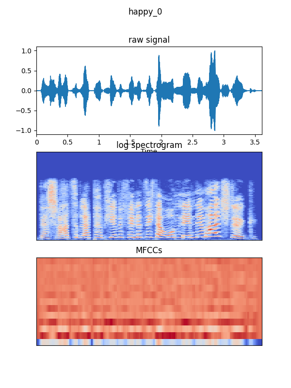

# Speech Emotion Recognition
Implementation of speech emotion recognition with [pytorch-lightning](https://www.pytorchlightning.ai/)

## Contents

* [Installation](#installation)
* [Data Analysis](#data-analysis)
* [Training](#training)
* [Pre-Trained Model Usage](#pre-trained-model-usage)
* [Testing](#testing)
* [Deployment](#deployment)
* [Tutorials](#tutorials)

## Installation
```shell
pip install -r requirements.txt
```

## Data Analysis

### Min & Mean & Max Audio Length For Each Emotion
```script
python calc_data_length.py --dataset emodb
```


### Check Label Distribution For Each Emotion
```script
python calc_label_dist.py --dataset emodb
```


### Visualize Random Audio Features For Each Emotion
```script
python visualize_features.py --dataset emodb --sample-rate 22050 --n-fft 2048 --hop-length 512 --n-mfcc 13
```
<p float="left">
  
  
  
  
</p>

## Training

## Pre-Trained Model Usage

## Testing

## Deployment

## Tutorials
